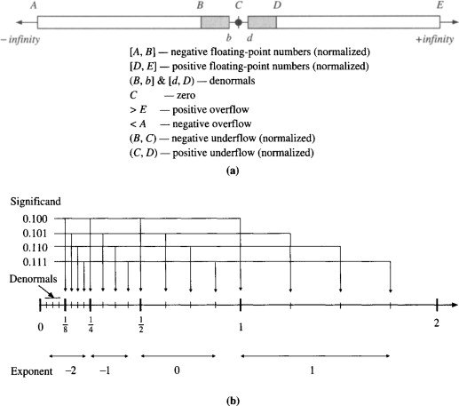

# Floating point basic

Following image shows how floating point values are distributed on number axis. According to [wiki](https://en.wikipedia.org/wiki/Single-precision_floating-point_format#Exponent_encoding), following picture shows how normal & subnormal values are distributed. we can see that:
 - without mantissa/significand, exponent along can represent :
   - 0          : subnormal 
   - 1~(Emax-1) : geometric sequence with common ratio of 2:
   - Emax       : infinity or NaN

In following example, geometric sequence $[\frac{1}{8}, \frac{1}{4}, \frac{1}{2}, 1]$ are encoded by exponent, and special subnormal range $[0,\frac{1}{8})$ and $[2,\infty)$  also encoded by exponent values, thus totally 6 exponent values are required (which is not friendly to binary encoding which usually has power of 2 number of values).



we can think of exponent value 1~(Emax-1) as encoding a sequence of length increasing geometrically, and these length are concatenated together to cover a continuous range in number axis, and significand/mantissa part encodes a series of discrete points equally distributed along each geometric length encoded by exponent.

Thus the whole floating point encoding is a combination of geometric & arithmetic sequence.

# rounding

In narrow sense, rounding means conversion from float point to integer. but broadly speaking it happens in conversion between any two representations who's element set are not fully coincides. for example, conversion between different float-point types. 

why roundTiesToEven is more accurate than Round-away-from-zero(四舍五入) taught in school? read [this](https://www.gnu.org/software/gawk/manual/html_node/Setting-the-rounding-mode.html)

different float-point representations are highly coincides with each other, for example, normal values of bfloat16 & float16 & fp8 & fp4 are subset of float32 normal values.

# Microscaling Formats (MX)

 - [OCP Microscaling Formats (MX) Specification Version 1.0](https://www.opencompute.org/documents/ocp-microscaling-formats-mx-v1-0-spec-final-pdf)
 - [Microscaling Data Formats for Deep Learning](https://arxiv.org/pdf/2310.10537)

| Format Name |  Block Size | Scale Data Format | Element Data Format|
| ----------- | ----------- | ----------------- | -------------------------- |
|   MXFP4     |      32     |    E8M0 (8bit)    | E2M1 (4bit)                |

definitions of E2M1 & E8M0 are modified from IEEE 754, the expression capability wasted on infinities and NaN are avoided, we can check 5.3.3 & 5.4.1 of [OCP MX specification][1]

 - Only scale (E8M0) can represent NaN
 - Infinities are not expressed by both scales & element

LUT for E2M1 element is defined [here](https://github.com/openvinotoolkit/openvino/blob/4a5bd43723eeaff934d58e188c23629b65189778/src/core/src/type/float4_e2m1.cpp#L20). notice that no NaN nor Infinity can be encoded, so ALU can handle them easier.

|encode| Exponent | Mantissa | enc-type | abs-value |  note  |
|------|----------|----------|----------|-----------|--------|
| s000 |   -1     |    0     | 0.x      |       0   | sub-norm/even |
| s001 |   -1     |    1     | 0.x      |     0.5   | sub-norm/odd  |
| s010 |    0     |    0     | 1.x      |     1.0   | normal/even   |
| s011 |    0     |    1     | 1.x      |     1.5   | normal/odd    |
| s100 |    1     |    0     | 1.x      |     2.0   | normal/even   |
| s101 |    1     |    1     | 1.x      |     3.0   | normal/odd    |
| s110 |    2     |    0     | 1.x      |     4.0   | normal/even/noInf-Nan |
| s111 |    2     |    1     | 1.x      |     6.0   | normal/odd/noInf-Nan |

for better statistical accuracy, conversion from float32 to E2M1 should use rounding mode : [roundTiesToEven][2]. we can see:
 - Although the conversion is not a typical rounding problem between float & integer. roundTiesToEven still apply.
 - although 1.0 is odd number, but it's treated as even
 - although 6.0 is even number, but it's treated as odd
 - thus odd & even is determined by its index in the representable sequence, or by value of mantissa, not the value of whole number.


E8M0 to float is defined [here](https://github.com/openvinotoolkit/openvino/blob/3056b53056d6319666f3fc250bebefb0c4b1a91e/src/core/src/type/float8_e8m0.cpp#L49), notice :
 - subnormal float are required to represent scale when exponent is -127
 - NaN is possible
 - no sign bit, thus no negative number is encoded.

As show in 6.1 of [OCP MX specification][1], dot product is done efficiently if input vectors are group aligned, thus for MatMul to benefit from this format, row of A matrix & column of B matrix must be converted to same MX format.

In case no special ALU is available, columns of B must be decompressed/converted_back to float (bf16/fp16) and A don't need to be encoded into MX formats at all.

# Accuracy test

Unit test is [here](./test.cpp).
```bash
g++ ./test.cpp
./a.out
```

But how this implementation works for LLM? how good the accuracy can be? we need to replace it into HF pipeline and test.

we will compress weights into MXFP4 format and recover it back (like FakeQuantize) to evaluate its impact on accuracy.

```bash
pip install git+https://github.com/EleutherAI/lm-evaluation-harness.git
lm_eval --model hf --tasks lambada_openai --model_args pretrained=meta-llama/Llama-2-7b-hf,trust_remote_code=True
```

# Optimization

In 6.1 of [OCP MX spec][1], if HW ALU support FP4-E2M1 dot-product, then MF-format can be boost performance if accuracy-drop is acceptable (see Table 6 of [Microscaling Data Formats for Deep Learning][3]).

Since there is no MXFP4 capable ALU on x86 for now, the only possible way is to decompress into BF16 or FP32 before using FMA, and the only benefits we can expect from this format is the reduction of second-token-latency.

BTW, oneDNN has a term vnni-2 which is defined as following (and little misleading):

```C++
case avx2_vnni_2:
    return mayiuse(avx2_vnni, soft) && cpu().has(Cpu::tAVX_VNNI_INT8)
            && cpu().has(Cpu::tAVX_NE_CONVERT);
```

According to [Intel® Architecture Instruction Set Extensions and Future Features]():

 - AVX_VNNI_INT8:
    - VPDPB[SU,UU,SS]D[,S]—Multiply and Add Unsigned and Signed Bytes With and Without Saturation
 - AVX-NE-CONVERT:
    - converts one element from bf16/fp16 and broadcast into packed fp32
    - converts odd/even elements from bf16/fp16 into fp32
    - converts packed fp32 into packed bf16

# Learn from compiler

We can find useful intrinsics in [Intel intrinsics-guide][4], but don't know the best way to write assembly\jit to implement them, for example, broadcast a 8bit constant into zmm register can be done by `_mm512_set1_epi8`, but how assembly would be? we can do following:
```c++
// find-inst.cpp
#include <immintrin.h>

__m512i test(char x) {
    auto a = _mm512_set1_epi8(x);
    auto b = _mm512_set1_epi8(127);
    return _mm512_add_epi8(a, b);
}
```
```bash
g++ ./find-inst.cpp -O2  -S -march=native -masm=intel -fverbose-asm
```
from `find-inst.s` we can learn how the assembly code look like.

[1]: https://www.opencompute.org/documents/ocp-microscaling-formats-mx-v1-0-spec-final-pdf
[2]: https://www.gnu.org/software/gawk/manual/html_node/Setting-the-rounding-mode.html
[3]: https://arxiv.org/abs/2310.10537
[4]: https://www.intel.com/content/www/us/en/docs/intrinsics-guide/index.html
